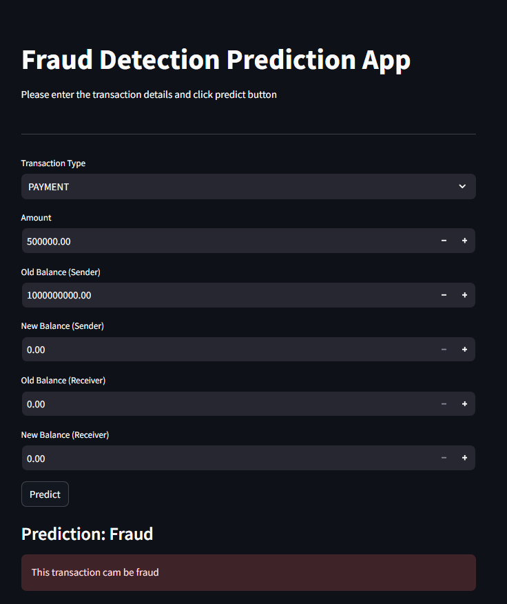
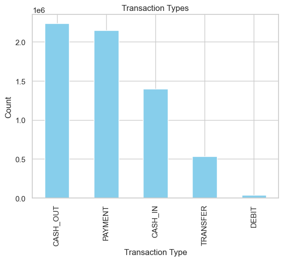
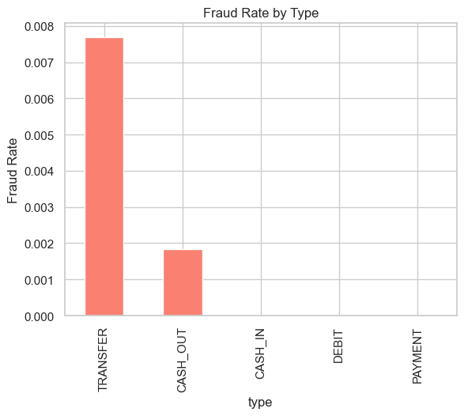
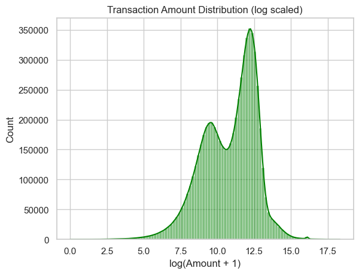
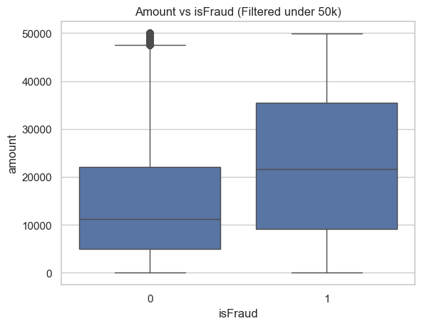
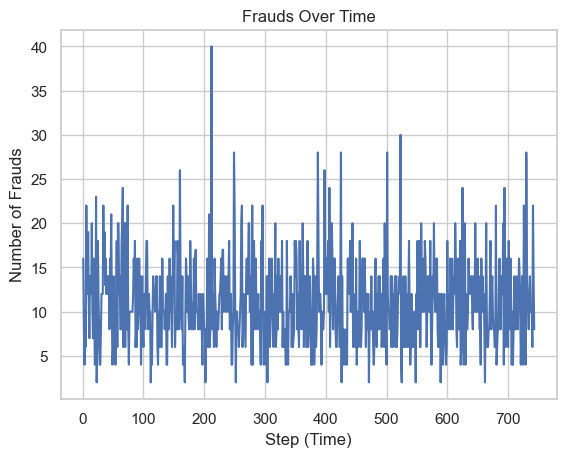
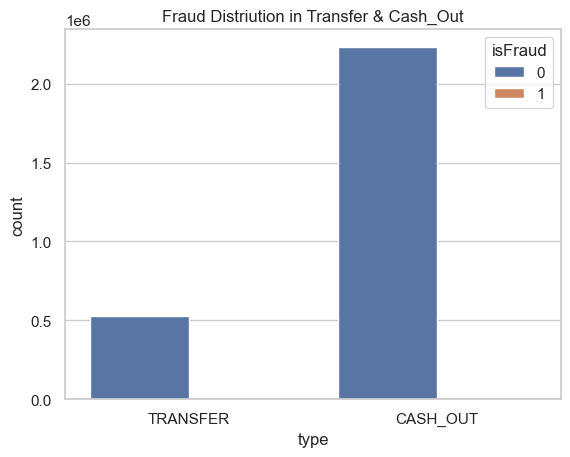
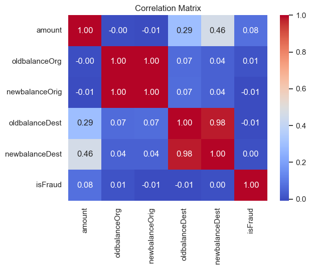
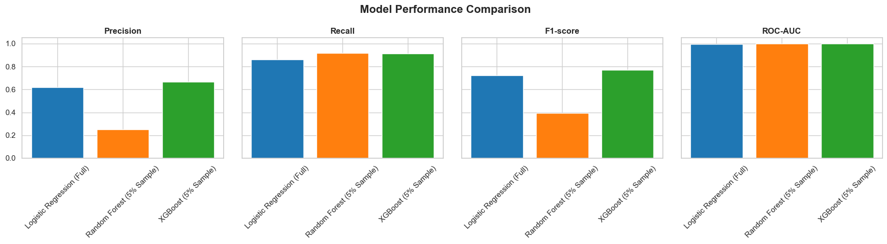

# Fraud Detection Pipeline with Web App

This project implements a machine learning pipeline for detecting fraudulent financial transactions using a dataset of transaction records.
**The trained model achieves an impressive 94% accuracy (see notebook for details).**

**Interactive Streamlit web app for predictions** → [Live Demo](https://frauddetectionpipeline.streamlit.app/)  

## Project Structure

- `ananlysis_model.ipynb`: Jupyter notebook containing EDA, feature engineering, model training, and evaluation.
- `fraud_detection.py`: Streamlit web app for predicting fraud on new transactions.
- `AIML Dataset.csv`: Transaction dataset (ignored by git).
- `fraud_detection_pipeline.pkl`: Saved trained pipeline (ignored by git).
- `images/`: Contains project-related images.
- `README.md`: Project documentation.

## Dataset

The dataset used in this project is available on Kaggle:  
[Fraud Detection Dataset](https://www.kaggle.com/datasets/amanalisiddiqui/fraud-detection-dataset?resource=download)

## Getting Started

### Requirements

- Python 3.12+
- Packages: pandas, numpy, matplotlib, seaborn, scikit-learn, streamlit, joblib

Install dependencies:

```sh
pip install pandas numpy matplotlib seaborn scikit-learn streamlit joblib
```

### Usage

#### 1. Data Analysis & Model Training

Open and run [`ananlysis_model.ipynb`](ananlysis_model.ipynb) to:

- Load and explore the dataset
- Engineer features (`balanceDiffOrig`, `balanceDiffDest`)
- Train a logistic regression pipeline
- Save the trained model as `fraud_detection_pipeline.pkl`

#### 2. Web App Prediction

Run the Streamlit app:

```sh
streamlit run fraud_detection.py
```

Enter transaction details to get a fraud prediction using the trained model.


## Features

- Exploratory Data Analysis (EDA)
- Feature engineering for transaction balances
- Machine learning pipeline with preprocessing and logistic regression
- Model evaluation (classification report, confusion matrix)
- Interactive web app for predictions

## Visualizations

Below are key charts from the analysis:

### Transaction Types Distribution


### Fraud Rate by Type


### Transaction Amount Distribution (Log Scaled)


### Amount vs isFraud (Boxplot)


### Frauds Over Time


### Fraud Distribution in Transfer & Cash_Out


### Correlation Matrix


## Model Details

- **Preprocessing:** Standard scaling for numeric features, one-hot encoding for transaction type.
- **Models:**
  - Logistic Regression (`class_weight='balanced'`, `max_iter=1000`) — trained on full dataset
  - Random Forest (ensemble, `class_weight='balanced'`, `n_estimators=100`, `max_depth=10`) — trained on 5% sample
  - XGBoost (ensemble, `n_estimators=100`, `max_depth=5`, `scale_pos_weight` to handle class imbalance) — trained on 5% sample
- **Features Used:** `type`, `amount`, `oldbalanceOrg`, `newbalanceOrig`, `oldbalanceDest`, `newbalanceDest`

## Model Comparison

Below is a comparison of Logistic Regression (trained on the full dataset) with ensemble models Random Forest and XGBoost (trained on a 5% sample due to computational constraints):

| Model                        | Precision | Recall | F1-score | ROC-AUC |
|------------------------------|-----------|--------|----------|---------|
| Logistic Regression (Full)   | 0.619     | 0.862  | 0.721    | 0.997   |
| Random Forest (5% Sample)    | 0.251     | 0.919  | 0.394    | 0.999   |
| XGBoost (5% Sample)          | 0.665     | 0.911  | 0.769    | 1.000   |



**Notes:**  
- Random Forest and XGBoost are **ensemble models**, trained on only a 5% representative sample to reduce computation time.  
- Logistic Regression was trained on the **full dataset** as it trains much faster.  
- XGBoost shows the highest metrics on the 5% sample, but this does **not guarantee it will outperform Logistic Regression on the full dataset**.  
- These results demonstrate the models’ ability to handle class imbalance and capture fraud patterns efficiently.


## Results

Model evaluation metrics and confusion matrix are available in the notebook output.  
See [`ananlysis_model.ipynb`](ananlysis_model.ipynb) for details.