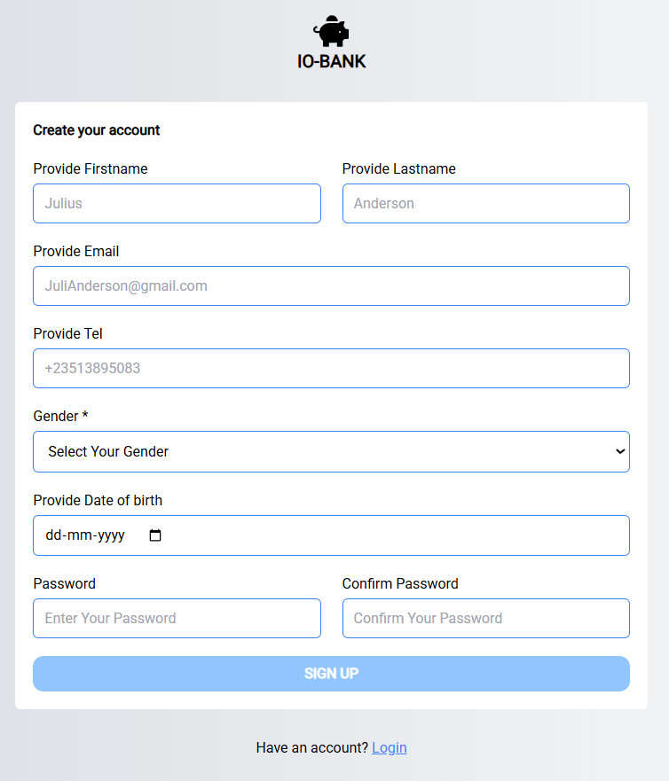
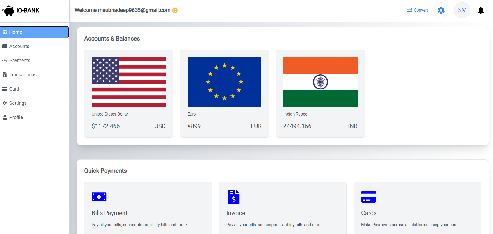
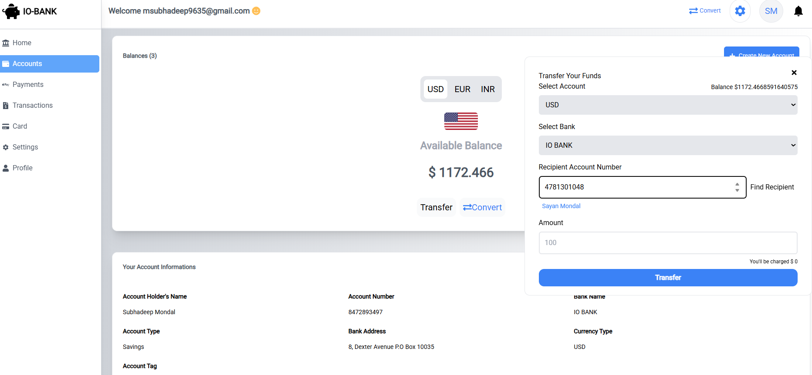
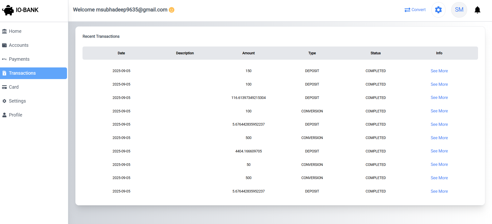
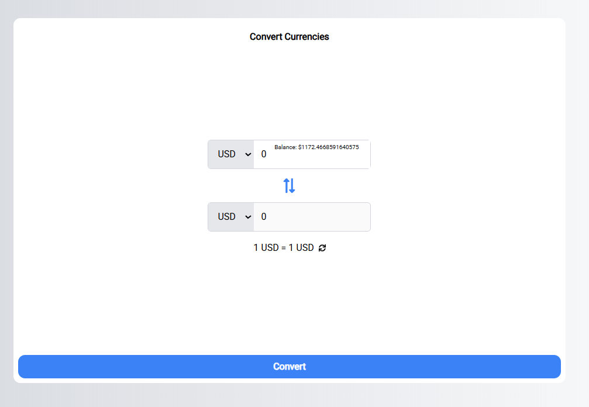
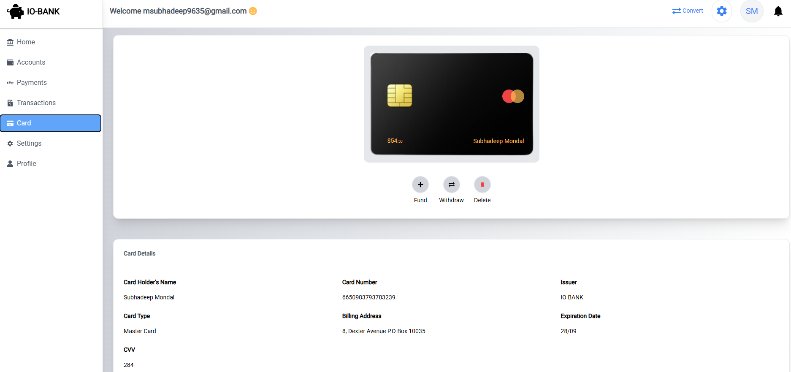

# Banking Management System

A comprehensive **Banking Management System** built with **Spring Boot**, providing secure user authentication, account management, transaction processing, and real-time currency conversion capabilities.

---
## 🎥 Demo Video

<a href="https://www.youtube.com/watch?v=_BrWRLFjBWU&cc_load_policy=1" target="_blank">
▶ Watch Demo Video on YouTube (with Subtitles)
</a>

## Features

### Core Banking Operations
- **User Management**: Secure user registration with **BCrypt password encryption** and **JWT-based authentication**.  
  

- **Account Services**: Create and manage **multi-currency accounts** with unique account numbers.  
  

- **Fund Transfers**: Secure money transfers between accounts with sender/receiver validation.  
  

- **Transaction History**: List of recent transactions with details.  
  

- **Currency Conversion**: Real-time currency exchange using live rates.  
  

- **Account Card**: Visual card-based display for accounts.  
  

### Security Features
- **JWT Token-based Stateless Authentication**: Ensures secure access to endpoints.
- **Password Encryption**: Using Spring Security’s BCrypt encoder.
- **Role-based Access Control**: Fine-grained access to resources.

---

## Tech Stack

### Backend Framework
- **Spring Boot 3.3.2** – Main application framework
- **Java 21** – Runtime platform

### Security & Authentication
- **Spring Security** – Authentication and authorization
- **JWT (jjwt 0.12.6)** – Token-based authentication

### Data Layer
- **Spring Data JPA** – ORM and repository abstraction
- **PostgreSQL** – Primary relational database

### Development Tools
- **Lombok** – Code generation and boilerplate reduction
- **Maven** – Build tool and dependency management

---

## Architecture

- **Layered Architecture**: Follows **Controller → Service → Repository** pattern for modularity.
- **Transactional Services**: Database transaction management ensures data integrity.
