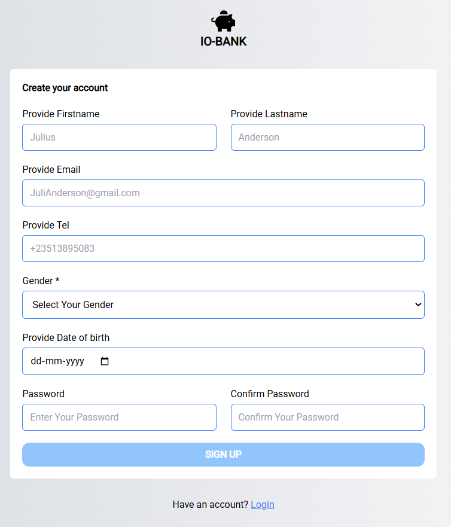
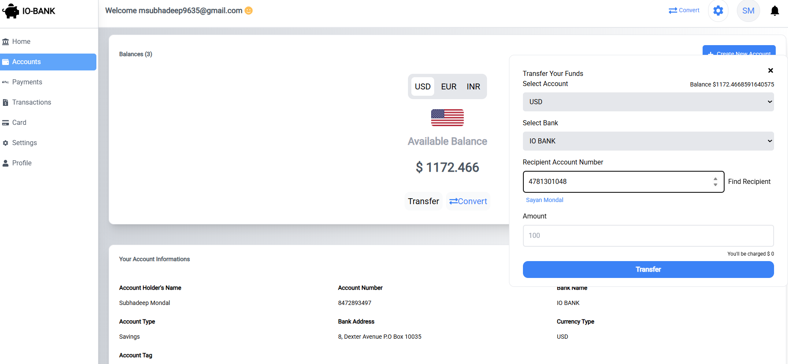
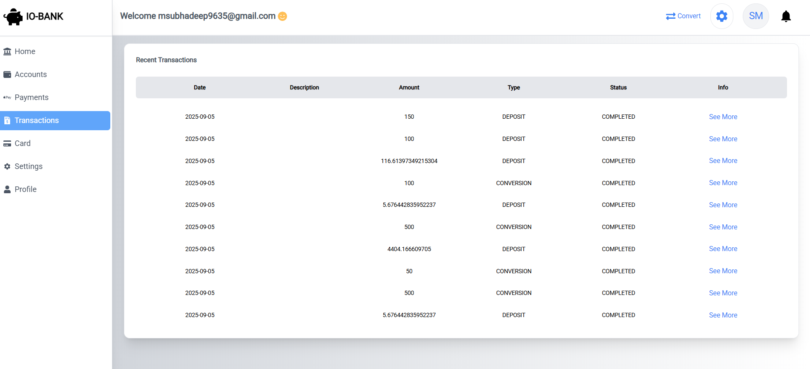
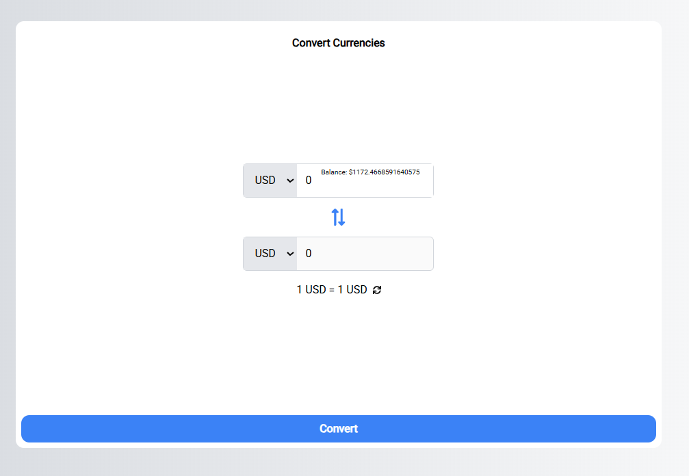
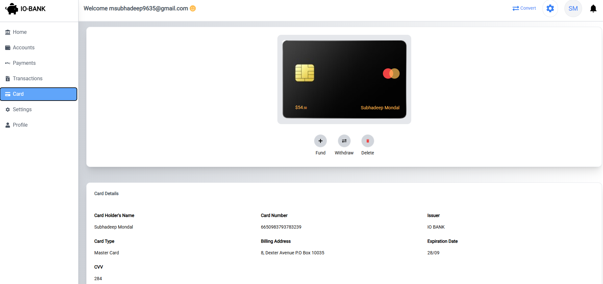

# Banking Management System with Transaction Fraud Detection

A comprehensive **Banking Management System** built with **Spring Boot**, providing secure user authentication, account management, transaction processing, and real-time currency conversion capabilities.

---
### 🚧 Ongoing Task: Transaction Fraud Detection Pipeline Integration

I am actively working on integrating a machine learning-based **Fraud Detection Pipeline** into the banking system.  
**Current Status:** Ongoing development.  
For details and progress, see the [Fraud Detection Pipeline](#fraud-detection-pipeline) section below in this README.


## 🎥 Demo Video

<a href="https://www.youtube.com/watch?v=CXwYpBrCdMo&cc_load_policy=1" target="_blank">
▶ Watch Demo Video on YouTube (with Subtitles)
</a>

## Features

### Core Banking Operations
- **User Management**: Secure user registration with **BCrypt password encryption** and **JWT-based authentication**.  
  

- **Account Services**: Create and manage **multi-currency accounts** with unique account numbers.  
  

- **Fund Transfers**: Secure money transfers between accounts with sender/receiver validation.  
  

- **Transaction History**: List of recent transactions with details.  
  

- **Currency Conversion**: Real-time currency exchange using live rates.  
  

- **Account Card**: Visual card-based display for accounts.  
  

### Security Features
- **JWT Token-based Stateless Authentication**: Ensures secure access to endpoints.
- **Password Encryption**: Using Spring Security’s BCrypt encoder.

---

##  Fraud Detection Pipeline

This repository also contains a dedicated [Fraud Detection Pipeline](Fraud_detection/README.md) in the `Fraud_detection` folder.  
It uses machine learning to detect fraudulent financial transactions.

**Interactive Streamlit web app for predictions** → [Live Demo](https://frauddetectionpipeline.streamlit.app/) 

**Key Features:**
- Exploratory Data Analysis (EDA) and feature engineering
- Machine learning pipeline (preprocessing + logistic regression)
- Model evaluation (classification report, confusion matrix)
- Interactive Streamlit web app for predictions

**How it works:**
- Data analysis and model training are performed in [`ananlysis_model.ipynb`](Fraud_detection/ananlysis_model.ipynb).
- The trained model is saved as `fraud_detection_pipeline.pkl`.
- The web app ([`fraud_detection.py`](Fraud_detection/fraud_detection.py)) loads this model and predicts fraud for new transactions.

**Integration Status:**  
Integration of the fraud detection pipeline with the main React + Spring Boot banking app is **under development**.  
Currently, the pipeline is maintained separately and will be merged once the integration is complete.  
You can follow progress or contribute directly within the [`Fraud_detection`](Fraud_detection) folder at the root of this repository.

For details, see [Fraud_detection/README.md](Fraud_detection/README.md).

---

## Tech Stack

### Backend Framework
- **Spring Boot 3.3.2** – Main application framework
- **Java 21** – Runtime platform

### Security & Authentication
- **Spring Security** – Authentication and authorization
- **JWT (jjwt 0.12.6)** – Token-based authentication

### Data Layer
- **Spring Data JPA** – ORM and repository abstraction
- **PostgreSQL** – Primary relational database

### Development Tools
- **Lombok** – Code generation and boilerplate reduction
- **Maven** – Build tool and dependency management

## 🚀 Getting Started

### Prerequisites
- Java 21 or higher  
- PostgreSQL database  
- Node.js (for frontend)  
- Maven (for backend build)  

### Backend Setup
```bash
# Clone repository
git clone <repo_url>

# Move to backend
cd banking

# Configure DB in application.properties
# Run application
mvn spring-boot:run
```

### Frontend Setup
```bash
cd client
npm install
npm start
```

## Contributing
Fork the repository  
Create a feature branch  
Make your changes  
Submit a pull request
